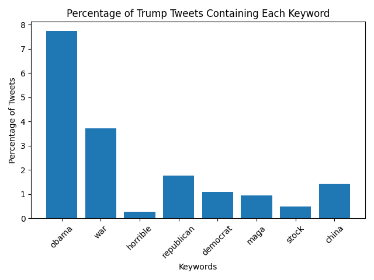

# Trump Tweet Keyword Chart From 2009–2018

This table and chart show the percentage of Donald Trump’s tweets (2009–2018) that contain each selected keyword.

## Results Table

Number of tweets = 35402
| phrase            | percent of tweets |
| ----------------- | ----------------- |
| obama             |     7.73             |
| war               |     3.72             |
| horrible          |     0.26             |
| republican        |     1.75             |
| democrat          |     1.09             |
| maga              |     0.93             |
| stock             |     0.47             |
| china             |     1.41             |

## Bar Chart

